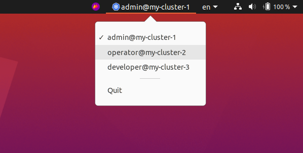

# kube-context
A cross-platform tool to switch between different Kubernetes [contexts](https://kubernetes.io/docs/tasks/access-application-cluster/configure-access-multiple-clusters) easily.  



## Installation
The executable is self-contained, so you can place it wherever you want and run it on startup.

### Linux
Add a file named `kube-context.Desktop` to your `~/.config/autostart` directory, with the following contents:
```
[Desktop Entry]
Name=kube-context
Icon=<path-to-executable>
Exec=<path-to-executable>
Terminal=false
Type=Application
X-GNOME-Autostart-enabled=true
```
and replace \<path-to-executable\> accordingly.

## Credits
- This tool was inspired by [turkenh's KubeContext](https://github.com/turkenh/KubeContext), which sadly was only available for MacOS.
- [getlantern's systray](https://github.com/getlantern/systray), a package to create cross-platform systray applications.
